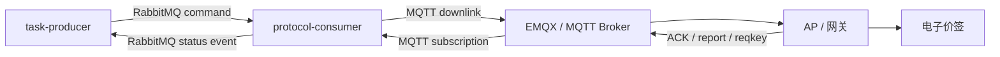

# ESL PanPan Protocol Consumer

`esl-panpan-protocol-consumer` 是攀攀电子价签 MVP 的协议消费者服务。它从 RabbitMQ 消费 producer 生成的统一任务，把任务转换为攀攀 MQTT topic/payload，下发到 EMQX，并处理 AP/ESL 上报。

它与 `esl-panpan-task-producer` 形成生产者-消费者闭环：producer 负责业务任务入口，consumer 负责协议执行和设备状态反馈。

## 职责边界

本服务负责：

- 消费 RabbitMQ `panpan.command.queue` 中的统一任务。
- 按 `messageType` 转换为攀攀 MQTT topic 和 payload。
- 发布 MQTT 下行消息到 EMQX。
- 订阅 AP/ESL 上行消息。
- 处理 AP heartbeat、runinfo、ACK、ESL report、reqkey。
- 把任务执行状态通过 RabbitMQ status event 回传给 producer。
- 对无终态任务做 consumer 侧 timeout 扫描。
- 对非法消息写入死信队列和事件日志。

本服务不负责：

- 后台商品、模板、门店、AP、价签 CRUD。
- 业务任务创建 API。
- producer 的任务幂等和状态查询 API。
- 真实后台权限、组织隔离和业务页面。

## 系统位置



## 技术栈

| 分类 | 技术 |
| --- | --- |
| Runtime | Java 17 |
| Framework | Spring Boot 3.3.x |
| MQ | Spring AMQP, RabbitMQ |
| MQTT | Eclipse Paho |
| Database | MySQL 8, Spring Data JPA, Flyway |
| Tests | JUnit 5, Mockito, Awaitility, Testcontainers |
| Build | Maven Wrapper |

## 快速启动

本仓库的 `docker-compose.yml` 会启动 consumer 所需的共享依赖：MySQL、RabbitMQ、EMQX。

```bash
cd /path/to/esl-panpan-protocol-consumer
docker compose up -d
./mvnw spring-boot:run
```

consumer 是后台进程，当前没有业务 HTTP API。启动成功后应看到：

- RabbitMQ command/report/status/dead 队列被声明。
- MQTT publisher 连接到 `tcp://localhost:1883`。
- MQTT report subscriptions 注册成功。

## 本地依赖

| 服务 | 宿主端口 | 账号 | 密码 | 用途 |
| --- | --- | --- | --- | --- |
| MySQL | `3307` | `panpan` | `panpan` | consumer 协议执行库 `esl_panpan` |
| RabbitMQ | `5673` | `panpan` | `panpan` | 四仓共享 RabbitMQ |
| RabbitMQ Management | `15673` | `panpan` | `panpan` | 队列管理台 |
| EMQX MQTT | `1883` | 无 | 无 | 本地 MQTT broker |
| EMQX Dashboard | `18083` | `admin` | `public` | MQTT 管理台 |

## 配置项

| 配置 | 默认值 | 说明 |
| --- | --- | --- |
| `SPRING_DATASOURCE_URL` | `jdbc:mysql://localhost:3307/esl_panpan...` | consumer 数据库 |
| `SPRING_DATASOURCE_USERNAME` | `panpan` | 数据库用户名 |
| `SPRING_DATASOURCE_PASSWORD` | `panpan` | 数据库密码 |
| `SPRING_RABBITMQ_HOST` | `localhost` | RabbitMQ host |
| `SPRING_RABBITMQ_PORT` | `5673` | RabbitMQ AMQP 端口 |
| `SPRING_RABBITMQ_USERNAME` | `panpan` | RabbitMQ 用户名 |
| `SPRING_RABBITMQ_PASSWORD` | `panpan` | RabbitMQ 密码 |
| `PANPAN_MQTT_BROKER_URL` | `tcp://localhost:1883` | EMQX/MQTT broker 地址 |
| `panpan.timeout.command-ttl` | `5m` | consumer 侧任务超时时间 |
| `panpan.timeout.scan-interval` | `30s` | timeout 扫描间隔 |

## RabbitMQ 契约

| 用途 | exchange | queue | routing key |
| --- | --- | --- | --- |
| 指令任务 | `esl.command.exchange` | `panpan.command.queue` | `panpan.command` |
| MQTT report 归一化事件 | `esl.report.exchange` | `panpan.report.queue` | `panpan.report` |
| 回传 producer 状态 | `esl.task.status.exchange` | `panpan.producer.status.queue` | `panpan.task.status` |
| 死信 | `esl.dead.exchange` | `panpan.dead.queue` | fanout |

## MQTT topic 契约

| 方向 | Topic | 说明 |
| --- | --- | --- |
| 下行 | `esl/server/mgr/{ap}` | AP 管理类命令，如绑定门店、时间同步 |
| 下行 | `esl/server/data/{shop}` | 门店数据类命令，如模板、字体、价签更新、密钥回复 |
| 上行 | `esl/ap/report/heart/{ap}` | AP 心跳 |
| 上行 | `esl/ap/report/runinfo/{ap}` | AP 运行信息 |
| 上行 | `esl/ap/report/tag/{ap}` | ESL 状态上报 |
| 上行 | `esl/ap/ack/{ap}` | AP ACK |
| 上行 | `esl/esl/reqkey/{shop}` | ESL 请求密钥 |

## 支持任务类型

| `messageType` | MQTT command | 说明 |
| --- | --- | --- |
| `AP_BIND_SHOP` | `shopcode` | AP 绑定门店 |
| `AP_TIME_SYNC` | `tmsync` | AP 时间同步 |
| `TEMPLATE_PUBLISH` | `tmpllist` | 模板发布 |
| `FONT_PUBLISH` | `fonts` | 字体发布 |
| `TAG_UPDATE` | `wtag` | 商品数据下发到价签 |
| `TAG_KEY_REPLY` | `dkey` | 内部密钥回复任务 |

`TAG_KEY_REPLY` 是 consumer 内部任务，不会再向 producer 回传状态，避免污染 producer 的业务任务状态。

## 状态回传

consumer 会在关键阶段发布 `TaskStatusEvent`：

| stage | status | 触发点 |
| --- | --- | --- |
| `MQTT_PUBLISHED` | `PUBLISHED` | MQTT 下发成功 |
| `AP_ACK` | `AP_ACKED` | 收到 AP ACK |
| `ESL_REPORTED` | `ESL_REPORTED` | 收到 ESL report |
| `FAILED` | `FAILED` | 消费、转换、发布失败 |
| `TIMEOUT` | `TIMEOUT` | consumer 侧超时扫描 |

迟到 ACK 会被记录到 consumer 本地，但如果任务已经是 `ESL_REPORTED` 或终态，不会继续回推 producer，避免状态倒退。

## 数据表

| 表 | 说明 |
| --- | --- |
| `command_task` | consumer 侧任务执行表 |
| `command_event_log` | 消费、发布、ACK/report、错误等事件日志 |
| `ap_device` | AP 心跳和运行信息 |
| `esl_tag` | ESL 状态上报结果 |
| `tag_key` | reqkey 自动生成/读取的 sk/tk |
| `flyway_schema_history` | Flyway migration 历史 |

## 手动联调

### 1. 查看队列

```bash
docker exec panpan-rabbitmq rabbitmqctl list_queues name messages consumers
```

### 2. 投递一条 TAG_UPDATE

四仓联调推荐通过 producer API 创建任务；如果要直接测试 consumer，也可以通过 RabbitMQ Management API 投递：

```bash
TASK_UUID="$(uuidgen | tr '[:upper:]' '[:lower:]')"

curl -u panpan:panpan -H 'content-type: application/json' \
  -X POST http://localhost:15673/api/exchanges/%2f/esl.command.exchange/publish \
  -d "{
    \"properties\": {\"content_type\": \"application/json\"},
    \"routing_key\": \"panpan.command\",
    \"payload_encoding\": \"string\",
    \"payload\": \"{\\\"messageType\\\":\\\"TAG_UPDATE\\\",\\\"brand\\\":\\\"PANPAN\\\",\\\"shopCode\\\":\\\"ZH01\\\",\\\"apCode\\\":\\\"ESLAP00000008\\\",\\\"tagId\\\":\\\"6597069770841\\\",\\\"templateName\\\":\\\"PRICEPROMO\\\",\\\"screenCode\\\":\\\"06\\\",\\\"modelDecimal\\\":6,\\\"forceRefresh\\\":1,\\\"product\\\":{\\\"productName\\\":\\\"脉动 维生素饮料青柠口味 600ML\\\",\\\"productCode\\\":\\\"6902538004045\\\",\\\"price\\\":\\\"10.80\\\",\\\"spec\\\":\\\"600ML\\\",\\\"qrContent\\\":\\\"esl.wdyc.cn\\\",\\\"promoPrice\\\":null},\\\"taskUuid\\\":\\\"${TASK_UUID}\\\",\\\"vendorTaskId\\\":39138}\"
  }"
```

### 3. 模拟 AP ACK

```bash
docker run --rm --network host eclipse-mosquitto:2 \
  mosquitto_pub -h localhost -p 1883 \
  -t "esl/ap/ack/ESLAP00000008" \
  -m "{\"id\":\"${TASK_UUID}\",\"code\":0}"
```

### 4. 模拟 ESL report

```bash
docker run --rm --network host eclipse-mosquitto:2 \
  mosquitto_pub -h localhost -p 1883 \
  -t "esl/ap/report/tag/ESLAP00000008" \
  -m "{\"id\":\"${TASK_UUID}\",\"tag\":\"6597069770841\",\"ssirs\":-42,\"batterysoc\":92,\"tempt\":23.5,\"ap\":\"ESLAP00000008\",\"shop\":\"ZH01\",\"stat\":4}"
```

### 5. 查询 consumer 数据库

```bash
docker compose exec mysql mysql -upanpan -ppanpan esl_panpan \
  -e "select task_uuid,message_type,status,mqtt_topic from command_task order by id desc limit 5;"
```

## 测试

```bash
./mvnw clean test
```

测试覆盖：

- RabbitMQ 指令消费。
- 攀攀 payload 转换。
- MQTT 发布 mock。
- AP ACK 与 ESL report。
- reqkey -> 内部 `TAG_KEY_REPLY`。
- 非法 JSON 死信。
- consumer timeout 扫描。
- 内部任务不回推 producer 状态。

## 常见问题

### command 队列有消息但 consumer 不消费

检查 consumer 是否连接到了同一套 RabbitMQ：

```bash
docker exec panpan-rabbitmq rabbitmqctl list_queues name messages consumers
```

`panpan.command.queue` 的 `consumers` 应为 `1` 或更高。

### producer 收不到状态回传

检查：

- `panpan.producer.status.queue` 是否存在。
- producer 是否连接 RabbitMQ `5673`。
- consumer 日志是否出现 `TaskStatusEvent` 发布失败。

### MQTT 没有下发

检查 EMQX：

```bash
docker logs panpan-emqx --tail 100
```

确认 consumer 日志中 MQTT publisher 已连接 `tcp://localhost:1883`。

### reqkey 后 producer 出现内部任务状态

这不是期望行为。`TAG_KEY_REPLY` 应由 consumer 内部处理，不应回推 producer 状态。请检查 `CommandTaskService.publishStatus` 是否仍过滤 `MessageType.TAG_KEY_REPLY`。

## 开发约定

- 新增任务类型时，需要同步 producer `TaskMessageType`、consumer `MessageType`、协议 builder 和集成测试。
- MQTT topic 规则变更必须同步更新 `TopicRouterTest` 和本文档。
- 真实 checksum/token 算法补齐时，优先替换 `ChecksumCalculator`、`TokenProvider` 接口实现，不要把算法散落到业务服务里。
